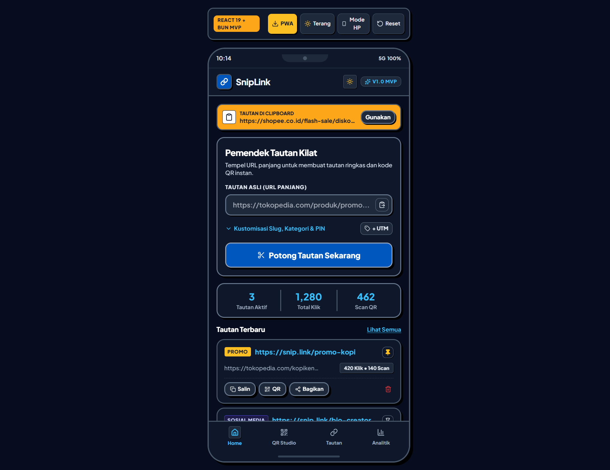
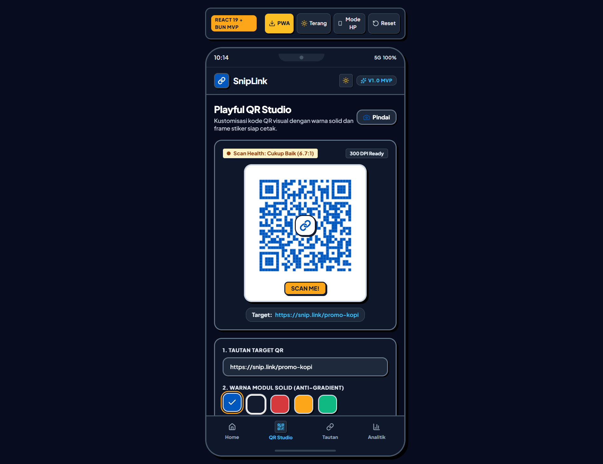
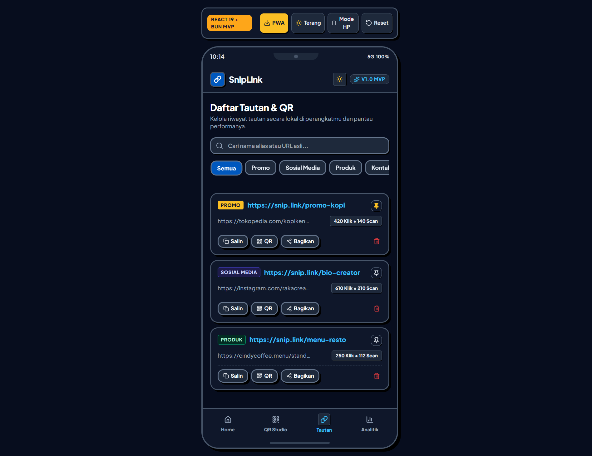
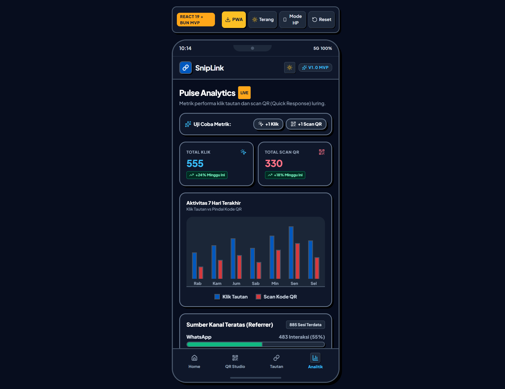

# Panduan Penggunaan & Tutorial Lengkap: SnipLink & QR Studio

Dokumen panduan operasional langkah demi langkah (*step-by-step tutorial*) untuk aplikasi **SnipLink & QR (Quick Response / Respon Cepat) Generator** dengan domain resmi **okus.me**.

---

## 1. Ikhtisar Aplikasi

SnipLink adalah aplikasi PWA (Progressive Web Application / Aplikasi Web Progresif) modern bergaya estetika Neo-Pop. Aplikasi ini menggabungkan dua fungsi utama:
1. **Pemendek Tautan Pintar (*Smart URL Shortener*)**: Memotong tautan panjang menjadi tautan ringkas berformat `https://okus.me/{slug}` dilengkapi pembuat parameter UTM (Urchin Tracking Module), alias kustom, dan proteksi PIN (Personal Identification Number / Nomor Identifikasi Pribadi).
2. **Playful QR Studio**: Membuat kode QR interaktif siap cetak (300 DPI / Dots Per Inch / Titik Per Inci) dengan palet warna solid anti-kamuflase, aneka bentuk modul, stiker bingkai CTA (Call To Action / Ajakan Bertindak), dan pemindai optik.
3. **Penyimpanan Lokal Mandiri**: Berjalan 100% luring (*offline-first*) menggunakan IndexedDB (Dexie) di peramban pengguna tanpa ketergantungan server eksternal untuk pengoperasian harian.

---

## 2. Tutorial Langkah demi Langkah: Pemendek Tautan (*Shortlink Generator*)



### Langkah 1: Tempel Tautan Asli (URL Panjang)
1. Buka aplikasi pada tab **Home (Beranda)**.
2. Masukkan tautan tujuan pada kolom **"Tautan Asli (URL Panjang)"**.
3. *Opsi Praktis:* Ketuk ikon **Tempel dari Clipboard** di sisi kanan kolom input atau gunakan spanduk otomatis **"Tautan di Clipboard"** jika terdeteksi.

### Langkah 2: Tambahkan Parameter UTM Pelacak Kampanye (Opsional)
1. Ketuk tombol **"+ UTM"** di kanan atas formulir kustomisasi.
2. Modal pembuat UTM akan muncul:
   - **UTM Source**: Sumber trafik (contoh: `instagram`, `tiktok`, `whatsapp`).
   - **UTM Medium**: Media publikasi (contoh: `bio`, `story`, `broadcast`).
   - **UTM Campaign**: Nama kampanye promosi (contoh: `promo_senin_ceria`).
3. Ketuk **"Terapkan Parameter UTM"**. Sistem akan otomatis menggabungkan parameter ke tautan asli.

### Langkah 3: Kustomisasi Alias Slug & Proteksi PIN (Opsional)
1. Ketuk akordeon **"Kustomisasi Slug, Kategori & PIN"**.
2. **Alias Slug Tautan**: Ketik kata kunci pendek yang diinginkan (contoh: `diskon-kopi`). Tautan akan menjadi `https://okus.me/diskon-kopi`. Jika dikosongkan, sistem membuat 6 karakter acak otomatis.
3. **Kategori Tautan**: Pilih label kelompok: `Promo`, `Sosial Media`, `Produk`, atau `Kontak`.
4. **Proteksi PIN (Keamanan)**: Masukkan 4 digit angka PIN jika tautan bersifat privat/rahasia.

### Langkah 4: Buat Tautan Ringkas
1. Ketuk tombol tebal **"Potong Tautan Sekarang"**.
2. Kartu hasil potong akan muncul seketika:
   - Tautan ringkas baru: `https://okus.me/{slug}`.
   - Tombol **Salin**: Menyalin tautan langsung ke papan klip (*clipboard*).
   - Tombol **Kustomisasi QR**: Membuka tautan langsung di Studio QR.
   - Tombol **Bagikan**: Membuka dialog berbagi sistem bawaan (*Web Share API*).

---

## 3. Tutorial Langkah demi Langkah: Playful QR Studio



### Langkah 1: Tentukan Tautan Target QR
1. Masuk ke tab **"QR Studio"** pada bilah navigasi bawah.
2. Kolom **"1. Tautan Target QR"** otomatis terisi tautan aktif, atau Anda dapat mengetik URL / teks apa pun secara manual.

### Langkah 2: Pilih Warna Modul Solid (Anti-Kamuflase)
1. Pada bagian **"2. Warna Modul Solid"**, pilih dari 5 palet kontras standar WCAG (Web Content Accessibility Guidelines / Pedoman Aksesibilitas Konten Web):
   - **Ink Navy (`#131B2E`)**: Hitam klasik dengan kontur putih melayang di mode gelap.
   - **Royal Blue (`#0058BE`)**: Biru korporat tajam (kontras 6.7:1).
   - **Neo Coral (`#D6393D`)**: Merah menyala ceria.
   - **Electric Amber (`#FEA619`)**: Kuning emas kontras.
   - **Mint Emerald (`#10B981`)**: Hijau segar.
2. Status indikator **Scan Health** otomatis menghitung kelayakan pembacaan optik kamera secara langsung.

### Langkah 3: Pilih Bentuk Modul & Stiker Bingkai CTA
1. **Bentuk Modul Pixel**:
   - `Balok (Chunky)`: Kotak fisik tegas khas gaya Neo-Pop.
   - `Bulat (Dots)`: Lingkaran modern halus.
   - `Squircle`: Kotak bersudut tumpul elegan.
2. **Bingkai Stiker CTA**:
   - `Tanpa Frame`: Tampilan minimalis murni.
   - `Stiker SCAN ME!`: Kartu stiker berpita bawah tebal bertuliskan ajakan pemindaian.
3. **Ikon Tengah**: Aktifkan saklar **"Tampilkan Logo Tengah"** untuk menyematkan lencana rantai (*link badge*) di pusat QR.

### Langkah 4: Unduh Format Cetak & Vektor
1. Ketuk **"Unduh PNG (300 DPI)"**: Menghasilkan berkas bitmap resolusi tinggi 800×800 pixel siap cetak pada brosur, banner, maupun standing tent.
2. Ketuk **"Unduh SVG Vektor"**: Menghasilkan berkas grafis vektor murni tanpa pecah untuk kebutuhan desainer grafis.
3. *Fitur Pemindai:* Ketuk tombol **"Pindai"** di kanan atas untuk menguji atau membaca kode QR fisik langsung melalui kamera perangkat.

---

## 4. Manajemen Riwayat & Pencarian Tautan



1. Masuk ke tab **"Tautan"** pada bilah bawah.
2. **Pencarian Kilat**: Ketik nama alias atau URL asli di kolom pencarian untuk menyaring tautan secara langsung.
3. **Filter Kategori**: Ketuk chip filter (`Semua`, `Promo`, `Sosial Media`, `Produk`, `Kontak`) untuk mengelompokkan data.
4. **Sematan Prioritas (*Pin to Top*)**: Ketuk ikon jarum pentol pada kartu untuk memposisikan tautan penting selalu di urutan teratas.
5. **Cadangan & Pemulihan (*Backup & Restore*)**:
   - Ketuk **"Ekspor JSON"** untuk mengunduh seluruh basis data lokal dalam format JSON.
   - Ketuk **"Ekspor CSV"** untuk membuka laporan tautan ke Microsoft Excel / Google Sheets.
   - Ketuk **"Impor Cadangan"** untuk memulihkan data dari berkas JSON sebelumnya.

---

## 5. Pemantauan Metrik: Pulse Analytics



1. Masuk ke tab **"Analitik"** pada bilah bawah.
2. **Ringkasan Metrik**: Memantau akumulasi total klik tautan web dan total pemindaian luring kode QR.
3. **Grafik Batang 7 Hari**: Menampilkan tren aktivitas harian. Ketuk batang grafik pada hari tertentu untuk melihat rincian angka secara spesifik.
4. **Sumber Kanal Teratas (*Referrer Breakdown*)**: Memantau persentase interaksi dari WhatsApp, Instagram, TikTok, dan peramban langsung.
5. **Sistem Operasi Pengunjung**: Memantau rasio perangkat pengguna antara Android dan Apple iOS.
6. **Uji Coba Cepat**: Gunakan tombol **"+1 Klik"** atau **"+1 Scan QR"** pada bilah atas untuk menyimulasikan data metrik seketika.

---

## 6. Pemasangan Aplikasi PWA (Android, iOS, & Desktop)

Aplikasi SnipLink dapat dipasang (*install*) langsung ke layar utama (*home screen*) ponsel tanpa perlu mengunduh dari Google Play Store atau Apple App Store:

### Pada Perangkat Android / Tablet
1. Saat membuka aplikasi pertama kali, modal pemasangan otomatis akan muncul.
2. Ketuk tombol **"Pasang Sekarang"**.
3. Konfirmasi dialog sistem peramban. Ikon SnipLink akan muncul di layar utama Anda.

### Pada Perangkat Apple iPhone / iPad (Safari)
1. Buka tautan di peramban Safari.
2. Ketuk tombol **Bagikan (Share)** (ikon kotak dengan panah ke atas di bilah navigasi Safari).
3. Gulir ke bawah dan pilih **"Tambahkan ke Layar Utama" (Add to Home Screen)**.
4. Ketuk **"Tambah"** di pojok kanan atas.

---

## 7. Implementasi Domain Asli: okus.me

Catatan arsitektur: Aplikasi frontend SnipLink saat ini adalah aplikasi web satu halaman berbasis sisi klien (*Client-Side Single Page Application*). Agar domain **`https://okus.me/{slug}`** dapat diakses publik oleh orang lain di internet dan langsung mengalihkan (*redirect*) ke URL asli, berikut adalah arsitektur implementasinya:

### Arsitektur Rekomendasi: Cloudflare Workers / Vercel Edge (Ringan & Berkecepatan Tinggi)

```text
[ Pengunjung Peramban ]
          │
          ▼  Akses https://okus.me/diskon-kopi
[ Cloudflare DNS (okus.me) ]
          │
          ▼
[ Cloudflare Worker / Edge Function ]
   ├── Jika path root (/) atau aset web (/assets/*):
   │       └── Sajikan Frontend SnipLink PWA (React + Vite)
   │
   └── Jika path adalah shortlink (/:slug):
           ├── Cari slug di Cloudflare KV / D1 / Upstash Redis
           ├── Catat log analitik (Klik/OS/Referrer)
           └── Kirim HTTP 301 / 302 Redirect ke Original URL
```

### Langkah Konfigurasi Domain okus.me:

#### 1. Pengaturan DNS Domain (Cloudflare)
1. Arahkan *Nameserver* domain `okus.me` ke Cloudflare.
2. Tambahkan DNS Record tipe `CNAME` atau `A` yang mengarah ke penyedia hosting frontend Anda (contoh: Vercel, Cloudflare Pages, Netlify, atau VPS Nginx).

#### 2. Konfigurasi Variabel Lingkungan Frontend
Aplikasi SnipLink telah dilengkapi konfigurasi terpusat di `src/config/appConfig.ts`. Untuk mengubah domain saat build produksi:
Buat berkas `.env.production`:
```env
VITE_APP_DOMAIN=okus.me
```
Jalankan build:
```bash
bun run build
```
Seluruh tautan yang dihasilkan otomatis menggunakan prefix `https://okus.me/{slug}`.

#### 3. Kode Worker Pengalihan (*Edge Redirector Script*)
Berikut adalah skrip copyable contoh Cloudflare Worker (`worker.js`) untuk menangani pengalihan link `okus.me`:

```javascript
export default {
  async fetch(request, env) {
    const url = new URL(request.url);
    const slug = url.pathname.slice(1); // Ambil slug setelah slash

    // Jika mengakses halaman utama atau aset statis, teruskan ke Frontend PWA
    if (!slug || slug.startsWith('assets') || slug.includes('.')) {
      return env.ASSETS ? env.ASSETS.fetch(request) : fetch(request);
    }

    // Ambil data tautan asli dari Cloudflare KV Storage
    const targetUrl = await env.SNIPLINK_KV.get(slug);

    if (targetUrl) {
      // Catat analitik asinkron tanpa memperlambat redirect
      env.ANALYTICS_QUEUE?.send({
        slug,
        timestamp: new Date().toISOString(),
        referrer: request.headers.get('referer') || 'Direct',
        userAgent: request.headers.get('user-agent') || ''
      });

      // Kembalikan status HTTP 302 Pengalihan Sementara
      return Response.redirect(targetUrl, 302);
    }

    // Jika slug tidak ditemukan, arahkan kembali ke aplikasi utama dengan notifikasi
    return Response.redirect(`${url.origin}/?notfound=${slug}`, 302);
  }
};
```

---

*Dokumen disusun secara rapi dan otomatis diperbarui untuk proyek SnipLink & QR Studio (okus.me).*
