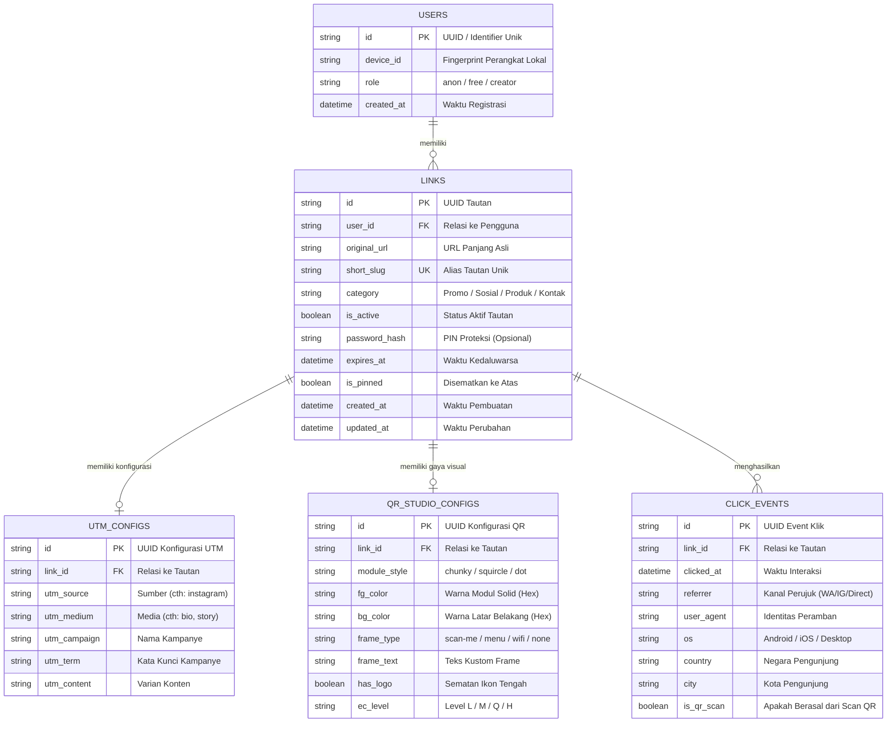

# Tech Stack & ERD: SnipLink MVP

**Proyek:** SnipLink & QR Generator Mobile  
**Versi:** 1.0  
**Tanggal:** 08 September 2026

---

## 1. Arsitektur Tech Stack Optimal

| Komponen | Pilihan Teknologi | Peran & Alasan Teknis |
| :--- | :--- | :--- |
| **Runtime & Package Manager** | **Bun** (v1.1+) | Eksekusi TypeScript bawaan, instalasi paket 5-10x lebih cepat dibanding npm/yarn. |
| **Frontend Framework** | **React** (v18+) + **Vite** | Ekosistem komponen luas, HMR (Hot Module Replacement / Penggantian Modul Cepat) instan, dukungan PWA (Progressive Web App / Aplikasi Web Progresif). |
| **Bahasa Pemrograman** | **TypeScript** (v5+) | Validasi tipe data ketat (*strict type-safety*), pencegahan bug saat runtime. |
| **Desain & Styling** | **Tailwind CSS** + Desain Token Neo-Pop | Utilitas kelas terstruktur, tanpa gradien, hard shadow 4px, border 2px solid `#131B2E`. |
| **State Management** | **Zustand** | Manajemen state reaktif 1KB tanpa boilerplate, middleware persistensi otomatis. |
| **Penyimpanan Lokal (Local-First)** | **Dexie.js (IndexedDB)** | Basis data luring di peramban/ponsel dengan performa tinggi untuk riwayat dan konfigurasi QR. |
| **Pustaka QR** | `qrcode` + `@zxing/library` | Rendering QR berbasis matriks kanvas/SVG dan pemindaian langsung via kamera perangkat. |
| **Backend & Redirect Engine (Edge)** | **Hono** on **Bun** | Framework HTTP mikro untuk pengalihan slug kilat (<10ms) dan pencatatan event analitik. |
| **Basis Data Server (Opsional Cloud)** | **SQLite / Turso (LibSQL)** via **Drizzle ORM** | Basis data relasional ringan, edge-ready, sinkronisasi data instan. |

---

## 2. ERD (Entity Relationship Diagram / Diagram Hubungan Entitas)

